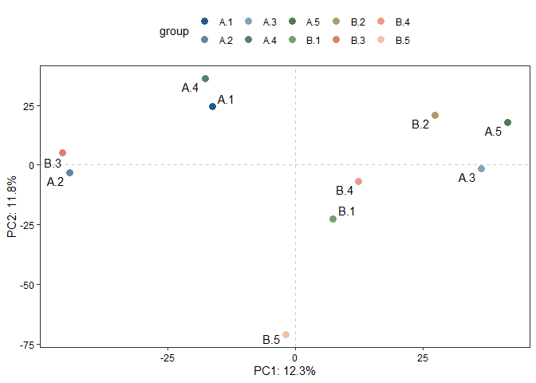

<!-- README.md is generated from README.Rmd. Please edit that file -->

# utilsR

<!-- badges: start -->
<!-- badges: end -->

`utilsR` is my personal R-based handful of utils in data analysis. Feel free to use it :)

## Installation

You can install the released version of utilsR the development version from [GitHub](https://github.com/) with:

``` r
# install.packages("devtools")
devtools::install_github("thereallda/utilsR")
```

## Example

``` r
library(utilsR)
#> Warning: replacing previous import 'lifecycle::last_warnings' by
#> 'rlang::last_warnings' when loading 'tibble'
#> Warning: replacing previous import 'lifecycle::last_warnings' by
#> 'rlang::last_warnings' when loading 'pillar'
```

### ggPCA

``` r
set.seed(123)
counts_mat <- matrix(rnbinom(30000, mu=100, size=1), ncol=10)
ggPCA(counts_mat, labels = paste(rep(c('A','B'), each=5), 1:5, sep = '.'), vst.norm = TRUE)
#> converting counts to integer mode
```



### BetweenStatPlot

``` r
data("iris")
head(iris)
#>   Sepal.Length Sepal.Width Petal.Length Petal.Width Species
#> 1          5.1         3.5          1.4         0.2  setosa
#> 2          4.9         3.0          1.4         0.2  setosa
#> 3          4.7         3.2          1.3         0.2  setosa
#> 4          4.6         3.1          1.5         0.2  setosa
#> 5          5.0         3.6          1.4         0.2  setosa
#> 6          5.4         3.9          1.7         0.4  setosa
BetweenStatPlot(iris, x = 'Species', y = 'Sepal.Width', color = 'Species')
```


