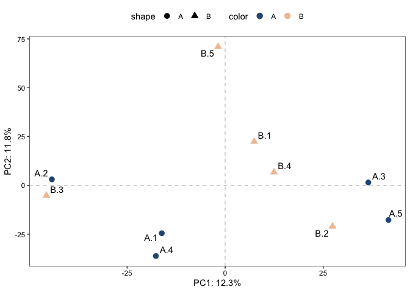
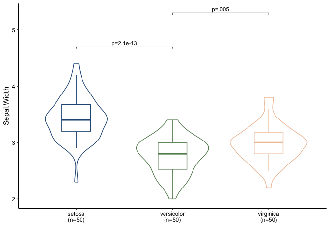

<!-- README.md is generated from README.Rmd. Please edit that file -->

# utilsR

<!-- badges: start -->
<!-- badges: end -->

`utilsR` is a personal R-based useful utils in data analysis. Feel free to use it :)

## Installation

You can install the released version of utilsR the development version from [GitHub](https://github.com/) with:

    # install.packages("devtools")
    devtools::install_github("thereallda/utilsR")

NOTE: Visualization of PCA (`PCAplot`) and `BetweenStatPlot` are now implemented in `enONE` package, which can be installed with:

    devtools::install_github("thereallda/enONE")

## Example

    library(utilsR)

### PCAplot

PCA plot from counts matrix

> Function to visualize PCA plot (`PCAplot`) now can be found at `enONE` package

    set.seed(123)
    counts_mat <- matrix(rnbinom(30000, mu=100, size=1), ncol=10)
    groups <- rep(c('A','B'), each=5)
    labels <- paste(rep(c('A','B'), each=5), 1:5, sep = '.')
    enONE::PCAplot(counts_mat, 
                   color = groups, 
                   shape = groups, 
                   label = labels, 
                   vst.norm = TRUE, 
                   repel = TRUE)

### BetweenStatPlot

Box-violin plot comparing values between groups

> `BetweenStatPlot` now can be found at `enONE` package

    data("iris")
    head(iris)
    #>   Sepal.Length Sepal.Width Petal.Length Petal.Width Species
    #> 1          5.1         3.5          1.4         0.2  setosa
    #> 2          4.9         3.0          1.4         0.2  setosa
    #> 3          4.7         3.2          1.3         0.2  setosa
    #> 4          4.6         3.1          1.5         0.2  setosa
    #> 5          5.0         3.6          1.4         0.2  setosa
    #> 6          5.4         3.9          1.7         0.4  setosa
    enONE::BetweenStatPlot(iris, x = 'Species', y = 'Sepal.Width', color = 'Species',
                           comparisons = list(c('setosa','versicolor'), c('versicolor','virginica')),
                    add.p = 'p')

### gene2goterm

Convert gene id to GO term

    # Convert gene id to GO term
    gene2goterm(c("ENSMUSG00000025981", "ENSMUSG00000057363"), organism = 'mmusculus')
    #>                 input   name
    #> 1  ENSMUSG00000057363   Uxs1
    #> 2  ENSMUSG00000057363   Uxs1
    #> 3  ENSMUSG00000057363   Uxs1
    #> 4  ENSMUSG00000025981 Coq10b
    #> 5  ENSMUSG00000057363   Uxs1
    #> 6  ENSMUSG00000057363   Uxs1
    #> 7  ENSMUSG00000057363   Uxs1
    #> 8  ENSMUSG00000057363   Uxs1
    #> 9  ENSMUSG00000057363   Uxs1
    #> 10 ENSMUSG00000057363   Uxs1
    #> 11 ENSMUSG00000057363   Uxs1
    #> 12 ENSMUSG00000057363   Uxs1
    #> 13 ENSMUSG00000025981 Coq10b
    #> 14 ENSMUSG00000025981 Coq10b
    #> 15 ENSMUSG00000057363   Uxs1
    #> 16 ENSMUSG00000057363   Uxs1
    #> 17 ENSMUSG00000057363   Uxs1
    #>                                                            description
    #> 1  UDP-glucuronate decarboxylase 1 [Source:MGI Symbol;Acc:MGI:1915133]
    #> 2  UDP-glucuronate decarboxylase 1 [Source:MGI Symbol;Acc:MGI:1915133]
    #> 3  UDP-glucuronate decarboxylase 1 [Source:MGI Symbol;Acc:MGI:1915133]
    #> 4                    coenzyme Q10B [Source:MGI Symbol;Acc:MGI:1915126]
    #> 5  UDP-glucuronate decarboxylase 1 [Source:MGI Symbol;Acc:MGI:1915133]
    #> 6  UDP-glucuronate decarboxylase 1 [Source:MGI Symbol;Acc:MGI:1915133]
    #> 7  UDP-glucuronate decarboxylase 1 [Source:MGI Symbol;Acc:MGI:1915133]
    #> 8  UDP-glucuronate decarboxylase 1 [Source:MGI Symbol;Acc:MGI:1915133]
    #> 9  UDP-glucuronate decarboxylase 1 [Source:MGI Symbol;Acc:MGI:1915133]
    #> 10 UDP-glucuronate decarboxylase 1 [Source:MGI Symbol;Acc:MGI:1915133]
    #> 11 UDP-glucuronate decarboxylase 1 [Source:MGI Symbol;Acc:MGI:1915133]
    #> 12 UDP-glucuronate decarboxylase 1 [Source:MGI Symbol;Acc:MGI:1915133]
    #> 13                   coenzyme Q10B [Source:MGI Symbol;Acc:MGI:1915126]
    #> 14                   coenzyme Q10B [Source:MGI Symbol;Acc:MGI:1915126]
    #> 15 UDP-glucuronate decarboxylase 1 [Source:MGI Symbol;Acc:MGI:1915133]
    #> 16 UDP-glucuronate decarboxylase 1 [Source:MGI Symbol;Acc:MGI:1915133]
    #> 17 UDP-glucuronate decarboxylase 1 [Source:MGI Symbol;Acc:MGI:1915133]
    #>        target                                   term ont
    #> 1  GO:0005737                              cytoplasm  CC
    #> 2  GO:0005739                          mitochondrion  CC
    #> 3  GO:0005794                        Golgi apparatus  CC
    #> 4  GO:0006744        ubiquinone biosynthetic process  BP
    #> 5  GO:0016020                               membrane  CC
    #> 6  GO:0016829                         lyase activity  MF
    #> 7  GO:0016831                 carboxy-lyase activity  MF
    #> 8  GO:0032580                Golgi cisterna membrane  CC
    #> 9  GO:0033320      UDP-D-xylose biosynthetic process  BP
    #> 10 GO:0042732             D-xylose metabolic process  BP
    #> 11 GO:0042802              identical protein binding  MF
    #> 12 GO:0042803      protein homodimerization activity  MF
    #> 13 GO:0045333                   cellular respiration  BP
    #> 14 GO:0048039                     ubiquinone binding  MF
    #> 15 GO:0048040 UDP-glucuronate decarboxylase activity  MF
    #> 16 GO:0070403                           NAD+ binding  MF
    #> 17 GO:1902494                      catalytic complex  CC

### ggVolcano

Volcano plot from DESeq2 results.

Use `lfc.col` and `p.col` to specify the colname names of log-fold-change and adjusted p-value, respectively.

Use `label.genes` to pass a vector of gene names (or gene ids consistent with rownames of the provided DE table) for label at the plot.

    library(DESeq2)
    dds <- makeExampleDESeqDataSet(n=5000, m=4, betaSD = 5)
    dds <- DESeq(dds)
    res <- results(dds, contrast=c("condition","B","A"))
    res.tab <- as.data.frame(res)
    head(res.tab)
    #>         baseMean log2FoldChange     lfcSE       stat      pvalue        padj
    #> gene1 253.769202      2.2844836 0.7388433  3.0919728 0.001988310 0.005167033
    #> gene2   5.699787     -6.6519825 2.6553685 -2.5051071 0.012241432 0.025721421
    #> gene3  14.433289      0.7819354 1.6547118  0.4725508 0.636533678 0.708435958
    #> gene4  18.020245     -1.3921289 1.2887634 -1.0802051 0.280050836 0.372627708
    #> gene5 102.400476      2.7771673 0.9751908  2.8478193 0.004401991 0.010509808
    #> gene6  17.788408     -3.9437631 1.4016648 -2.8136278 0.004898590 0.011530616
    ggVolcano(res.tab,   
              lfc.col = "log2FoldChange",
              p.col = "padj",
              up.lfc.cutoff = 1,
              down.lfc.cutoff = -1,
              p.cutoff = 0.05,
              title = 'Condition: B/A',
              label.genes = c('gene877','gene763','gene4239','gene3325'),
              repel = T)

