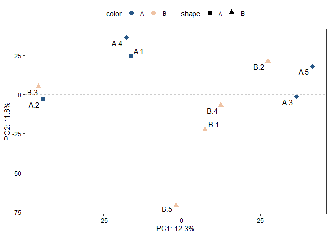

<!-- README.md is generated from README.Rmd. Please edit that file -->

# utilsR

<!-- badges: start -->
<!-- badges: end -->

`utilsR` is my personal R-based useful utils in data analysis. Feel free
to use it :)

## Installation

You can install the released version of utilsR the development version
from [GitHub](https://github.com/) with:

``` r
# install.packages("devtools")
devtools::install_github("thereallda/utilsR")
```

## Example

``` r
library(utilsR)
```

### ggPCA

PCA plot from counts matrix

``` r
set.seed(123)
counts_mat <- matrix(rnbinom(30000, mu=100, size=1), ncol=10)
groups <- rep(c('A','B'), each=5)
labels <- paste(rep(c('A','B'), each=5), 1:5, sep = '.')
ggPCA(counts_mat, group = groups, label = labels, vst.norm = TRUE)
#> converting counts to integer mode
```



### BetweenStatPlot

Box-violin plot comparing values between groups

``` r
data("iris")
head(iris)
#>   Sepal.Length Sepal.Width Petal.Length Petal.Width Species
#> 1          5.1         3.5          1.4         0.2  setosa
#> 2          4.9         3.0          1.4         0.2  setosa
#> 3          4.7         3.2          1.3         0.2  setosa
#> 4          4.6         3.1          1.5         0.2  setosa
#> 5          5.0         3.6          1.4         0.2  setosa
#> 6          5.4         3.9          1.7         0.4  setosa
BetweenStatPlot(iris, x = 'Species', y = 'Sepal.Width', color = 'Species')
```


### gene2goterm

Convert gene id to GO term

``` r
# Convert gene id to GO term
gene2goterm(c("ENSMUSG00000025981", "ENSMUSG00000057363"), organism = 'mmusculus')
#>    input_number              input target_number     target
#> 1             2 ENSMUSG00000057363           2.1 GO:0005737
#> 2             2 ENSMUSG00000057363           2.2 GO:0005739
#> 3             2 ENSMUSG00000057363           2.3 GO:0005794
#> 4             1 ENSMUSG00000025981           1.1 GO:0006744
#> 5             2 ENSMUSG00000057363           2.4 GO:0016020
#> 6             2 ENSMUSG00000057363           2.5 GO:0016021
#> 7             2 ENSMUSG00000057363           2.6 GO:0016829
#> 8             2 ENSMUSG00000057363           2.7 GO:0016831
#> 9             2 ENSMUSG00000057363           2.8 GO:0032580
#> 10            2 ENSMUSG00000057363           2.9 GO:0033320
#> 11            2 ENSMUSG00000057363          2.10 GO:0042732
#> 12            2 ENSMUSG00000057363          2.11 GO:0042802
#> 13            2 ENSMUSG00000057363          2.12 GO:0042803
#> 14            1 ENSMUSG00000025981           1.2 GO:0045333
#> 15            1 ENSMUSG00000025981           1.3 GO:0048039
#> 16            2 ENSMUSG00000057363          2.13 GO:0048040
#> 17            2 ENSMUSG00000057363          2.14 GO:0070403
#> 18            2 ENSMUSG00000057363          2.15 GO:1902494
#>                                 term_name   name
#> 1                               cytoplasm   Uxs1
#> 2                           mitochondrion   Uxs1
#> 3                         Golgi apparatus   Uxs1
#> 4         ubiquinone biosynthetic process Coq10b
#> 5                                membrane   Uxs1
#> 6          integral component of membrane   Uxs1
#> 7                          lyase activity   Uxs1
#> 8                  carboxy-lyase activity   Uxs1
#> 9                 Golgi cisterna membrane   Uxs1
#> 10      UDP-D-xylose biosynthetic process   Uxs1
#> 11             D-xylose metabolic process   Uxs1
#> 12              identical protein binding   Uxs1
#> 13      protein homodimerization activity   Uxs1
#> 14                   cellular respiration Coq10b
#> 15                     ubiquinone binding Coq10b
#> 16 UDP-glucuronate decarboxylase activity   Uxs1
#> 17                           NAD+ binding   Uxs1
#> 18                      catalytic complex   Uxs1
#>                                                            description
#> 1  UDP-glucuronate decarboxylase 1 [Source:MGI Symbol;Acc:MGI:1915133]
#> 2  UDP-glucuronate decarboxylase 1 [Source:MGI Symbol;Acc:MGI:1915133]
#> 3  UDP-glucuronate decarboxylase 1 [Source:MGI Symbol;Acc:MGI:1915133]
#> 4                    coenzyme Q10B [Source:MGI Symbol;Acc:MGI:1915126]
#> 5  UDP-glucuronate decarboxylase 1 [Source:MGI Symbol;Acc:MGI:1915133]
#> 6  UDP-glucuronate decarboxylase 1 [Source:MGI Symbol;Acc:MGI:1915133]
#> 7  UDP-glucuronate decarboxylase 1 [Source:MGI Symbol;Acc:MGI:1915133]
#> 8  UDP-glucuronate decarboxylase 1 [Source:MGI Symbol;Acc:MGI:1915133]
#> 9  UDP-glucuronate decarboxylase 1 [Source:MGI Symbol;Acc:MGI:1915133]
#> 10 UDP-glucuronate decarboxylase 1 [Source:MGI Symbol;Acc:MGI:1915133]
#> 11 UDP-glucuronate decarboxylase 1 [Source:MGI Symbol;Acc:MGI:1915133]
#> 12 UDP-glucuronate decarboxylase 1 [Source:MGI Symbol;Acc:MGI:1915133]
#> 13 UDP-glucuronate decarboxylase 1 [Source:MGI Symbol;Acc:MGI:1915133]
#> 14                   coenzyme Q10B [Source:MGI Symbol;Acc:MGI:1915126]
#> 15                   coenzyme Q10B [Source:MGI Symbol;Acc:MGI:1915126]
#> 16 UDP-glucuronate decarboxylase 1 [Source:MGI Symbol;Acc:MGI:1915133]
#> 17 UDP-glucuronate decarboxylase 1 [Source:MGI Symbol;Acc:MGI:1915133]
#> 18 UDP-glucuronate decarboxylase 1 [Source:MGI Symbol;Acc:MGI:1915133]
#>            namespace
#> 1  ARRAYEXPRESS,ENSG
#> 2  ARRAYEXPRESS,ENSG
#> 3  ARRAYEXPRESS,ENSG
#> 4  ARRAYEXPRESS,ENSG
#> 5  ARRAYEXPRESS,ENSG
#> 6  ARRAYEXPRESS,ENSG
#> 7  ARRAYEXPRESS,ENSG
#> 8  ARRAYEXPRESS,ENSG
#> 9  ARRAYEXPRESS,ENSG
#> 10 ARRAYEXPRESS,ENSG
#> 11 ARRAYEXPRESS,ENSG
#> 12 ARRAYEXPRESS,ENSG
#> 13 ARRAYEXPRESS,ENSG
#> 14 ARRAYEXPRESS,ENSG
#> 15 ARRAYEXPRESS,ENSG
#> 16 ARRAYEXPRESS,ENSG
#> 17 ARRAYEXPRESS,ENSG
#> 18 ARRAYEXPRESS,ENSG
```
