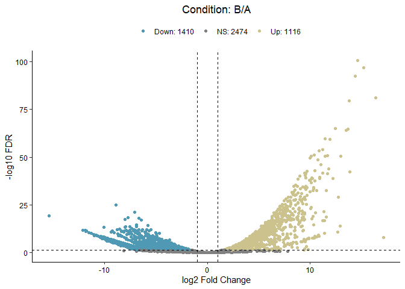

<!-- README.md is generated from README.Rmd. Please edit that file -->

# utilsR

<!-- badges: start -->
<!-- badges: end -->

`utilsR` is my personal R-based useful utils in data analysis. Feel free
to use it :)

## Installation

You can install the released version of utilsR the development version
from [GitHub](https://github.com/) with:

``` r
# install.packages("devtools")
devtools::install_github("thereallda/utilsR")
```

## Example

``` r
library(utilsR)
```

### ggPCA

PCA plot from counts matrix

``` r
set.seed(123)
counts_mat <- matrix(rnbinom(30000, mu=100, size=1), ncol=10)
groups <- rep(c('A','B'), each=5)
labels <- paste(rep(c('A','B'), each=5), 1:5, sep = '.')
ggPCA(counts_mat, color = groups, shape = groups, 
      label = labels, vst.norm = TRUE, repel = TRUE)
```


### BetweenStatPlot

Box-violin plot comparing values between groups

``` r
data("iris")
head(iris)
#>   Sepal.Length Sepal.Width Petal.Length Petal.Width Species
#> 1          5.1         3.5          1.4         0.2  setosa
#> 2          4.9         3.0          1.4         0.2  setosa
#> 3          4.7         3.2          1.3         0.2  setosa
#> 4          4.6         3.1          1.5         0.2  setosa
#> 5          5.0         3.6          1.4         0.2  setosa
#> 6          5.4         3.9          1.7         0.4  setosa
BetweenStatPlot(iris, x = 'Species', y = 'Sepal.Width', color = 'Species',
                comparisons = list(c('setosa','versicolor'), c('versicolor','virginica')),
                add.p = 'p')
```


### gene2goterm

Convert gene id to GO term

``` r
# Convert gene id to GO term
gene2goterm(c("ENSMUSG00000025981", "ENSMUSG00000057363"), organism = 'mmusculus')
#>                 input   name
#> 1  ENSMUSG00000057363   Uxs1
#> 2  ENSMUSG00000057363   Uxs1
#> 3  ENSMUSG00000057363   Uxs1
#> 4  ENSMUSG00000025981 Coq10b
#> 5  ENSMUSG00000057363   Uxs1
#> 6  ENSMUSG00000057363   Uxs1
#> 7  ENSMUSG00000057363   Uxs1
#> 8  ENSMUSG00000057363   Uxs1
#> 9  ENSMUSG00000057363   Uxs1
#> 10 ENSMUSG00000057363   Uxs1
#> 11 ENSMUSG00000057363   Uxs1
#> 12 ENSMUSG00000057363   Uxs1
#> 13 ENSMUSG00000057363   Uxs1
#> 14 ENSMUSG00000025981 Coq10b
#> 15 ENSMUSG00000025981 Coq10b
#> 16 ENSMUSG00000057363   Uxs1
#> 17 ENSMUSG00000057363   Uxs1
#> 18 ENSMUSG00000057363   Uxs1
#>                                                            description
#> 1  UDP-glucuronate decarboxylase 1 [Source:MGI Symbol;Acc:MGI:1915133]
#> 2  UDP-glucuronate decarboxylase 1 [Source:MGI Symbol;Acc:MGI:1915133]
#> 3  UDP-glucuronate decarboxylase 1 [Source:MGI Symbol;Acc:MGI:1915133]
#> 4                    coenzyme Q10B [Source:MGI Symbol;Acc:MGI:1915126]
#> 5  UDP-glucuronate decarboxylase 1 [Source:MGI Symbol;Acc:MGI:1915133]
#> 6  UDP-glucuronate decarboxylase 1 [Source:MGI Symbol;Acc:MGI:1915133]
#> 7  UDP-glucuronate decarboxylase 1 [Source:MGI Symbol;Acc:MGI:1915133]
#> 8  UDP-glucuronate decarboxylase 1 [Source:MGI Symbol;Acc:MGI:1915133]
#> 9  UDP-glucuronate decarboxylase 1 [Source:MGI Symbol;Acc:MGI:1915133]
#> 10 UDP-glucuronate decarboxylase 1 [Source:MGI Symbol;Acc:MGI:1915133]
#> 11 UDP-glucuronate decarboxylase 1 [Source:MGI Symbol;Acc:MGI:1915133]
#> 12 UDP-glucuronate decarboxylase 1 [Source:MGI Symbol;Acc:MGI:1915133]
#> 13 UDP-glucuronate decarboxylase 1 [Source:MGI Symbol;Acc:MGI:1915133]
#> 14                   coenzyme Q10B [Source:MGI Symbol;Acc:MGI:1915126]
#> 15                   coenzyme Q10B [Source:MGI Symbol;Acc:MGI:1915126]
#> 16 UDP-glucuronate decarboxylase 1 [Source:MGI Symbol;Acc:MGI:1915133]
#> 17 UDP-glucuronate decarboxylase 1 [Source:MGI Symbol;Acc:MGI:1915133]
#> 18 UDP-glucuronate decarboxylase 1 [Source:MGI Symbol;Acc:MGI:1915133]
#>        target                                   term ont
#> 1  GO:0005737                              cytoplasm  CC
#> 2  GO:0005739                          mitochondrion  CC
#> 3  GO:0005794                        Golgi apparatus  CC
#> 4  GO:0006744        ubiquinone biosynthetic process  BP
#> 5  GO:0016020                               membrane  CC
#> 6  GO:0016021         integral component of membrane  CC
#> 7  GO:0016829                         lyase activity  MF
#> 8  GO:0016831                 carboxy-lyase activity  MF
#> 9  GO:0032580                Golgi cisterna membrane  CC
#> 10 GO:0033320      UDP-D-xylose biosynthetic process  BP
#> 11 GO:0042732             D-xylose metabolic process  BP
#> 12 GO:0042802              identical protein binding  MF
#> 13 GO:0042803      protein homodimerization activity  MF
#> 14 GO:0045333                   cellular respiration  BP
#> 15 GO:0048039                     ubiquinone binding  MF
#> 16 GO:0048040 UDP-glucuronate decarboxylase activity  MF
#> 17 GO:0070403                           NAD+ binding  MF
#> 18 GO:1902494                      catalytic complex  CC
```

### ggVolcano

Volcano plot from DESeq2 results.

Use `lfc.col` and `p.col` to specify the colname names of
log-fold-change and adjusted p-value, respectively.

``` r
library(DESeq2)
dds <- makeExampleDESeqDataSet(n=5000, m=4, betaSD = 5)
dds <- DESeq(dds)
res <- results(dds, contrast=c("condition","B","A"))
res.tab <- as.data.frame(res)
head(res.tab)
#>         baseMean log2FoldChange    lfcSE      stat       pvalue         padj
#> gene1   2.820962      -5.637869 3.709957 -1.519659 1.285968e-01 0.1932561981
#> gene2 403.740821       1.895269 0.702049  2.699626 6.941753e-03 0.0154768000
#> gene3   5.051294      -2.867754 2.261119 -1.268290 2.046946e-01 0.2871087123
#> gene4  16.856751      -5.747668 1.637413 -3.510212 4.477494e-04 0.0013619046
#> gene5  17.767703      -8.292778 2.006103 -4.133775 3.568526e-05 0.0001393287
#> gene6  14.808851      -1.923152 1.595389 -1.205444 2.280320e-01 0.3147115489
ggVolcano(res.tab,   
          lfc.col = "log2FoldChange",
          p.col = "padj",
          up.lfc.cutoff = 1,
          down.lfc.cutoff = -1,
          p.cutoff = 0.05,
          title = 'Condition: B/A')
```


